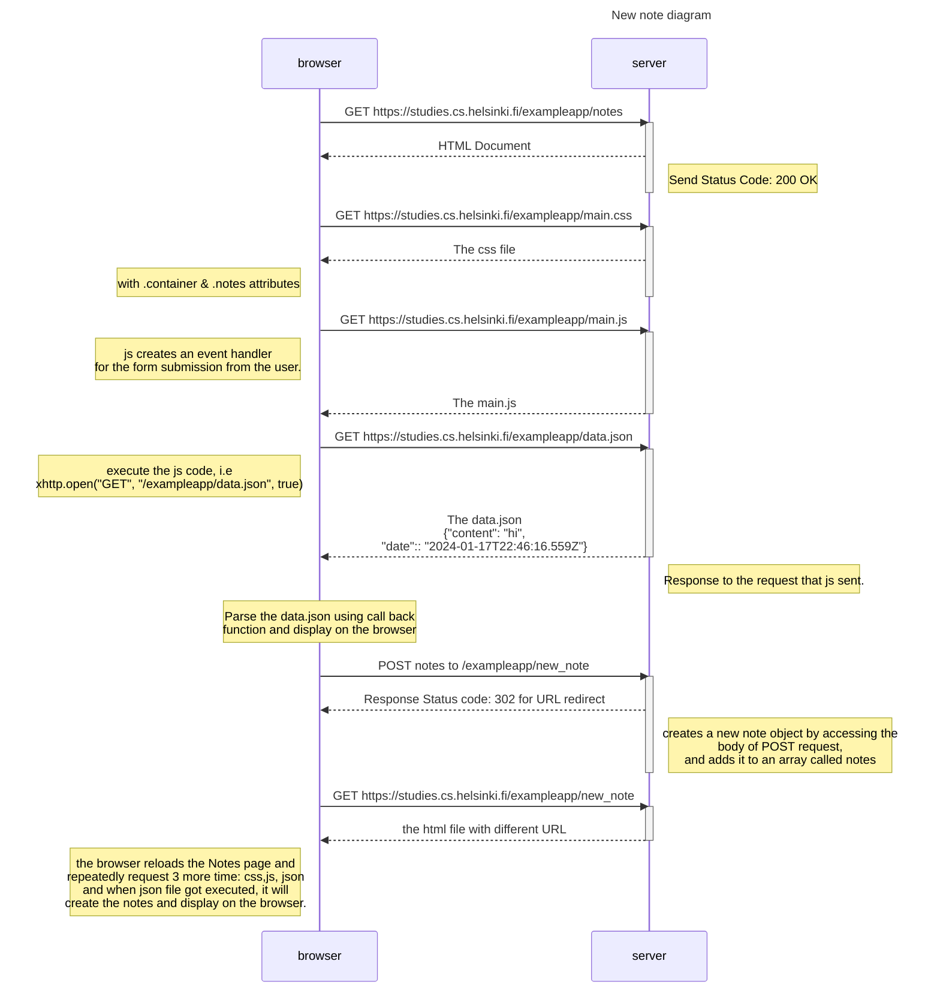

```mermaid
sequenceDiagram
title: New note diagram
    participant B as browser
    participant S as server
    
    B->>S: GET https://studies.cs.helsinki.fi/exampleapp/notes
	activate S
	S-->>B: HTML Document
    Note right of S: Send Status Code: 200 OK
	deactivate S

    B->>S: GET https://studies.cs.helsinki.fi/exampleapp/main.css
    activate S
    S-->>B: The css file
    Note left of B: with .container & .notes attributes
    deactivate S

    B->>S: GET https://studies.cs.helsinki.fi/exampleapp/main.js
    activate S
    Note left of B: js creates an event handler<br>for the form submission from the user.
    S-->>B: The main.js
    deactivate S

    B->>S: GET https://studies.cs.helsinki.fi/exampleapp/data.json
    activate S
    Note left of B: execute the js code, i.e<br>xhttp.open("GET", "/exampleapp/data.json", true)
    S-->>B: The data.json<br>{"content": "hi",<br>"date":: "2024-01-17T22:46:16.559Z"}
    deactivate S
    Note right of S: Response to the request that js sent.
    Note over B: Parse the data.json using call back<br> function and display on the browser

    B->>S: POST notes to /exampleapp/new_note
    activate S
    S-->>B: Response Status code: 302 for URL redirect
    Note right of S:  creates a new note object by accessing the <br>body of POST request,<br> and adds it to an array called notes 
    deactivate S

    B->>S: GET https://studies.cs.helsinki.fi/exampleapp/new_note
    activate S
    S-->>B: the html file with different URL
    deactivate S
    Note left of B: the browser reloads the Notes page and <br>repeatedly request 3 more time: css,js, json<br>and when json file got executed, it will<br> create the notes and display on the browser.


```