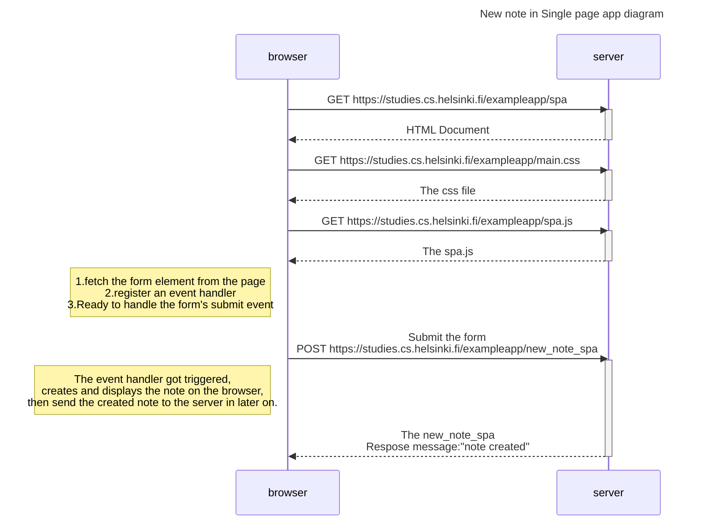

```mermaid
sequenceDiagram
title: New note in Single page app diagram

	participant B as browser
	participant S as server
	
	B->>S: GET https://studies.cs.helsinki.fi/exampleapp/spa
	activate S
	S-->>B: HTML Document
	deactivate S
	
	B->>S: GET https://studies.cs.helsinki.fi/exampleapp/main.css
	activate S
	S-->>B: The css file
	deactivate S
	
	B->>S: GET https://studies.cs.helsinki.fi/exampleapp/spa.js
	activate S
	S-->>B: The spa.js
	deactivate S
	Note left of B: 1.fetch the form element from the page<br>2.register an event handler<br>3.Ready to handle the form's submit event
	
	B->>S: Submit the form <br>POST https://studies.cs.helsinki.fi/exampleapp/new_note_spa
	activate S
	Note left of B: The event handler got triggered,<br>creates and displays the note on the browser, <br/> then send the created note to the server in later on.
	S-->>B: The new_note_spa<br>Respose message:"note created"
	deactivate S
```